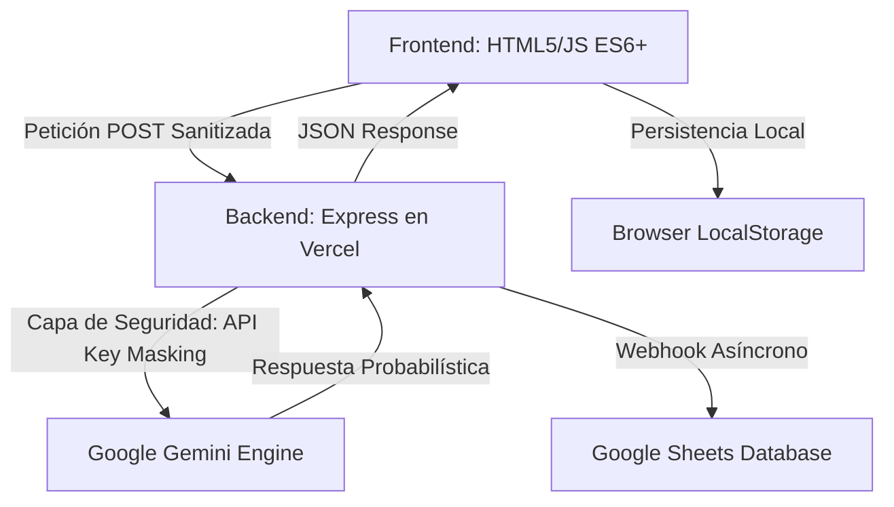

# Build with AI - ITCM 2026
## Programación Web [AEB-1055] - Plataforma de Innovación Tecnológica de Grado Industrial

---

## Acceso Rápido
**Sitio Web Oficial:** [build-with-ai-itcm.vercel.app](https://build-with-ai-itcm.vercel.app/)

---

## Tabla de Contenidos
1. [Introducción y Contexto](#introducción-y-contexto)
2. [Identidad Institucional y Ecosistema](#identidad-institucional-y-ecosistema)
3. [Metodología de Desarrollo](#metodología-de-desarrollo)
4. [Estrategia PWA (Progressive Web App) y Modo Offline](#estrategia-pwa-progressive-web-app-y-modo-offline)
5. [Análisis Detallado de Funcionalidades](#análisis-detallado-de-funcionalidades)
6. [Arquitectura del Sistema y Flujo de Datos](#arquitectura-del-sistema-y-flujo-de-datos)
7. [Ingeniería de Backend: Clase AIRequestHandler](#ingeniería-de-backend-clase-airequesthandler)
8. [Ingeniería de Prompts (Prompt Engineering)](#ingeniería-de-prompts-prompt-engineering)
9. [Auditoría Técnica: IA y Desarrollo Web Moderno](#auditoría-técnica-ia-y-desarrollo-web-moderno)
10. [Seguridad y Hardening de la Aplicación](#seguridad-y-hardening-de-la-aplicación)
11. [Optimización de Performance, SEO y QA](#optimización-de-performance-seo-y-qa)
12. [Diseño Responsivo, Accesibilidad y UX](#diseño-responsivo-accesibilidad-y-ux)
13. [Sinergia Institucional y Branding](#sinergia-institucional-y-branding)
14. [Estructura del Proyecto y Glosario](#estructura-del-proyecto-y-glosario)
15. [Guía de Instalación, Configuración y Despliegue](#guía-de-instalación-configuración-y-despliegue)
16. [Roadmap y Futuras Implementaciones](#roadmap-y-futuras-implementaciones)
17. [Contribución y Licencia](#contribución-y-licencia)
18. [Autor](#autor)

---

## Introducción y Contexto

El repositorio **Build with AI - ITCM 2026** representa la culminación de un esfuerzo de desarrollo orientado a la excelencia académica y tecnológica. Esta plataforma ha sido diseñada como el núcleo operativo para la gestión de propuestas en el marco de la gira universitaria de **Google Developers**, la cual tendrá lugar en el **Instituto Tecnológico de Ciudad Madero** el próximo **25 de Mayo de 2026**.

A diferencia de las aplicaciones web convencionales, este sistema ha sido concebido bajo un paradigma de **Inteligencia Artificial Integrada**, donde el frontend y el backend colaboran no solo para almacenar información, sino para asistirla, validarla y mejorarla en tiempo real. Este proyecto se presenta como una solución soberana del **TecNM**, demostrando la capacidad de los estudiantes del ITCM para liderar la transformación digital regional.

---

## Identidad Institucional y Ecosistema

Este proyecto no es una entidad aislada, sino que forma parte de un ecosistema digital más amplio dedicado a la carrera de **Ingeniería en Sistemas Computacionales**. Su diseño y funcionalidad están intrínsecamente ligados al portal oficial de la carrera:

**Portal ISC-ITCM:** [jjho05.github.io/ISC-ITCM/](https://jjho05.github.io/ISC-ITCM/)

La alineación visual con los estándares de **Material Design 3** de Google, combinada con la sobriedad institucional del ITCM, garantiza que la plataforma proyecte una imagen de vanguardia y profesionalismo. Cada elemento, desde la paleta de colores hasta la tipografía, ha sido seleccionado para reforzar el sentido de pertenencia y el orgullo por nuestra institución.

> [!IMPORTANT]
> **Visión de Excelencia:**  
> Tanto el portal **ISC-ITCM** como esta plataforma **Build with AI** son el resultado de la visión técnica y el compromiso de **Jesús Olvera**. Estos proyectos buscan establecer un nuevo estándar de calidad en las herramientas digitales utilizadas por nuestra comunidad académica.

---

## Metodología de Desarrollo

Para la realización de este proyecto se siguió un ciclo de vida de desarrollo de software (SDLC) iterativo, priorizando la agilidad y la calidad técnica:

1. **Análisis de Requerimientos:** Identificación de las necesidades de la comunidad estudiantil y los requisitos técnicos de la gira Google Developers.
2. **Diseño de Arquitectura:** Definición del modelo de datos y la estrategia de seguridad para el manejo de APIs externas.
3. **Desarrollo Frontend:** Implementación de una interfaz limpia y responsiva utilizando estándares modernos de CSS (Grid y Flexbox).
4. **Integración de IA:** Configuración y entrenamiento de prompts para el motor Gemini 3.0 Flash.
5. **Pruebas y QA:** Auditoría de seguridad, pruebas de carga en el chatbot y validación de la persistencia de datos.

---

## Estrategia PWA (Progressive Web App) y Modo Offline

Para garantizar que la plataforma sea accesible incluso en condiciones de baja conectividad durante el evento masivo, se ha implementado tecnología PWA:

- **Manifiesto de Aplicación:** Configuración de `manifest.json` con iconos de alta resolución (512x512) para permitir la instalación de la app en pantallas de inicio de Android e iOS.
- **Service Worker (sw.js):** Implementación de una estrategia de almacenamiento en caché para activos críticos. Esto asegura que la estructura básica del sitio y el formulario carguen instantáneamente.
- **Inmersión Móvil:** Uso de la meta-etiqueta `theme-color` para integrar la barra de direcciones del navegador con la paleta de colores institucional de Google.

---

## Análisis Detallado de Funcionalidades

La plataforma integra una serie de módulos avanzados que garantizan una experiencia de usuario fluida y una gestión de datos eficiente:

### 1. Motor de Captura y Persistencia
- **Validación Dinámica:** El formulario de propuestas cuenta con un motor de análisis léxico en tiempo real que contabiliza las palabras del usuario, asegurando calidad institucional.
- **Draft Persistence (Drafts):** Capa de persistencia basada en `localStorage` para evitar la pérdida de información por recargas accidentales.
- **Copy Proposal Logic:** Botón inteligente en el modal de éxito que permite al usuario copiar su propuesta al portapapeles mediante la API `navigator.clipboard`.

### 2. Gemini Assistant (Chatbot Contextual)
- **Generación Asíncrona:** Conectado a **Gemini 3.0 Flash**, ofreciendo respuestas de alta fidelidad con latencia mínima.
- **Quick Starter Prompts:** Botones de sugerencia rápida que facilitan el inicio de la conversación sobre temas clave del evento.
- **Skeleton & Typing:** Feedback visual avanzado mediante indicadores de escritura y estados de carga animados.

### 3. Google Integration Suite
- **Webhook de Google Sheets:** Sincronización asíncrona de datos en tiempo real.
- **Multiprocesamiento de Inputs:** Clasificación automática entre propuestas de innovación y consultas de soporte técnico.

---

## Arquitectura del Sistema y Flujo de Datos

La arquitectura sigue un modelo **Serverless Proxy Pattern**, diseñado para maximizar la seguridad y la escalabilidad:

---

## Ingeniería de Backend: Clase AIRequestHandler

Para garantizar un código mantenible y escalable, el backend utiliza un patrón de Programación Orientada a Objetos (OOP). La clase `AIRequestHandler` se encarga de:

- **Constructor Modular:** Recibe el payload del formulario y lo normaliza según el tipo de solicitud.
- **Sanitización Dinámica:** Limpia el texto de entrada eliminando etiquetas HTML y caracteres potencialmente peligrosos.
- **Pipeline de Datos:** Estructura la información de manera uniforme para su envío tanto a la IA como a la base de datos externa de Google Sheets.

---

## Ingeniería de Prompts (Prompt Engineering)

El comportamiento del chatbot es el resultado de una ingeniería de prompts rigurosa:

- **System Instruction:** Personalidad profesional, amable y representativa de Build with AI ITCM.
- **Control de Formato:** Entrega de respuestas en Markdown limpio, renderizado mediante `marked.js`.
- **Sanitización UI:** Integración de **DOMPurify** para limpiar cualquier contenido generado por la IA antes de insertarlo en el DOM, previniendo ataques XSS.

---

## Auditoría Técnica: IA y Desarrollo Web Moderno

### 1. Inferencia vs. Consulta Tradicional
Transición del determinismo tradicional al **Probabilismo** de la IA generativa, gestionado mediante ventanas de contexto masivas.

### 2. Time To First Token (TTFT)
Optimización de la latencia para una respuesta "instantánea" del asistente.

### 3. Patrones de Diseño CSS
Uso exclusivo de **CSS Grid** y **Flexbox** con variables de entorno (Tokens), reduciendo el bundle size al mínimo.

---

## Seguridad y Hardening de la Aplicación

- **API Key Proxying:** Protección total de llaves en el servidor.
- **DOMPurify Integration:** Sanitización obligatoria en el cliente para todos los flujos de datos dinámicos.
- **CORS Policy:** Restricción de dominios para asegurar la integridad de la API.
- **Personalized 404:** Página de error institucional (`404.html`) para guiar al usuario de vuelta al ecosistema seguro.

---

## Optimización de Performance, SEO y QA

- **Social Share Optimization (Open Graph):** Etiquetas Meta y Twitter Cards con imagen de previsualización profesional (`og-image.png`).
- **Asset Optimization:** Uso de formatos vectoriales (SVG) para logotipos institucionales.
- **Lighthouse Compliance:** Puntuaciones de alto nivel en accesibilidad y mejores prácticas de SEO.

---

## Diseño Responsivo, Accesibilidad y UX

Filosofía **Mobile First**:
- **Grid Layouts:** Rejillas flexibles adaptables a cualquier resolución de pantalla.
- **Accesibilidad (A11y):** Cumplimiento de estándares WCAG con contrastes validados y etiquetas ARIA.
- **Micro-interacciones:** Feedback táctil y visual en botones y elementos interactivos.

---

## Sinergia Institucional y Branding

El footer de la plataforma representa la alianza estratégica entre dos pilares de la innovación:
- **Google Developers:** Representado por el logo oficial con transparencia institucional.
- **ITCM:** El logo del Instituto Tecnológico de Ciudad Madero se presenta en su **color institucional original**, con un tamaño destacado (**60px**) para reafirmar la soberanía tecnológica del Tecnológico Nacional de México.

---

## Estructura del Proyecto y Glosario

- `/public`: Activos estáticos y configuración de cliente.
  - `index.html`: Núcleo de la plataforma.
  - `contacto.html`: Soporte y contacto.
  - `404.html`: Página de error personalizada.
  - `sw.js`: Service Worker de la PWA.
  - `manifest.json`: Manifiesto de instalación.
- `server.js`: Orquestación Full-Stack y lógica de negocio.

---

## Guía de Instalación, Configuración y Despliegue

1. Clonar: `git clone https://github.com/jjho05/build-with-ai-itcm.git`
2. Instalar: `npm install`
3. Configurar `.env`: `GEMINI_API_KEY` y `GOOGLE_SHEET_WEBHOOK_URL`.
4. Ejecutar: `npm run dev`

---

## Roadmap y Futuras Implementaciones

- **Autenticación Institucional.**
- **Dashboard de Administrador.**
- **Análisis de Sentimiento en Contactos.**

---

## Contribución y Licencia

**Licencia:** MIT. Ver `LICENSE` para más información.

---

## Autor

**Jesús Olvera**  
**Estudiante de Ingeniería en Sistemas Computacionales**  
Instituto Tecnológico de Ciudad Madero

- **Portal de la Carrera (ISC-ITCM):** [jjho05.github.io/ISC-ITCM/](https://jjho05.github.io/ISC-ITCM/)  
- **GitHub:** [@jjho05](https://github.com/jjho05)
- **Email:** [jjho.reivaj05@gmail.com](mailto:jjho.reivaj05@gmail.com)

---

**Por mi Patria y por mi Bien**  
**Orgullo Tec Madero** 🦅

© 2026 - Tecnológico Nacional de México  
Instituto Tecnológico de Ciudad Madero
