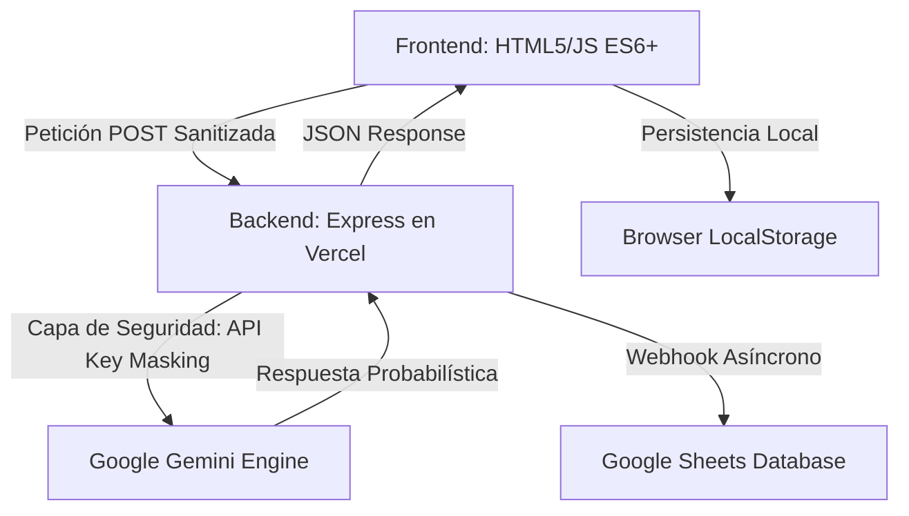

# Build with AI - ITCM 2026
## Programación Web [AEB-1055] - Plataforma de Innovación Tecnológica de Grado Industrial

---

## Tabla de Contenidos
1. [Introducción y Contexto](#introducción-y-contexto)
2. [Identidad Institucional y Ecosistema](#identidad-institucional-y-ecosistema)
3. [Análisis Detallado de Funcionalidades](#análisis-detallado-de-funcionalidades)
4. [Arquitectura del Sistema y Flujo de Datos](#arquitectura-del-sistema-y-flujo-de-datos)
5. [Auditoría Técnica: IA y Desarrollo Web Moderno](#auditoría-técnica-ia-y-desarrollo-web-moderno)
6. [Seguridad y Hardening de la Aplicación](#seguridad-y-hardening-de-la-aplicación)
7. [Estructura del Proyecto y Glosario](#estructura-del-proyecto-y-glosario)
8. [Guía de Instalación, Configuración y Despliegue](#guía-de-instalación-configuración-y-despliegue)
9. [Créditos, Autoría y Compromiso Institucional](#créditos-autoría-y-compromiso-institucional)

---

## Introducción y Contexto

El repositorio **Build with AI - ITCM 2026** representa la culminación de un esfuerzo de desarrollo orientado a la excelencia académica y tecnológica. Esta plataforma ha sido diseñada como el núcleo operativo para la gestión de propuestas en el marco de la gira universitaria de **Google Developers**, la cual tendrá lugar en el **Instituto Tecnológico de Ciudad Madero** el próximo **25 de Mayo de 2026**.

A diferencia de las aplicaciones web convencionales, este sistema ha sido concebido bajo un paradigma de **Inteligencia Artificial Integrada**, donde el frontend y el backend colaboran no solo para almacenar información, sino para asistirla, validarla y mejorarla en tiempo real. Este proyecto se presenta como una solución soberana del **TecNM**, demostrando la capacidad de los estudiantes del ITCM para liderar la transformación digital regional.

---

## Identidad Institucional y Ecosistema

Este proyecto no es una entidad aislada, sino que forma parte de un ecosistema digital más amplio dedicado a la carrera de **Ingeniería en Sistemas Computacionales**. Su diseño y funcionalidad están intrínsecamente ligados al portal oficial de la carrera:

**Portal ISC-ITCM:** [jjho05.github.io/ISC-ITCM/](https://jjho05.github.io/ISC-ITCM/)

La alineación visual con los estándares de **Material Design 3** de Google, combinada con la sobriedad institucional del ITCM, garantiza que la plataforma proyecte una imagen de vanguardia y profesionalismo. Cada elemento, desde la paleta de colores hasta la tipografía, ha sido seleccionado para reforzar el sentido de pertenencia y el orgullo por nuestra institución.

> [!IMPORTANT]
> **Autoría y Liderazgo:**  
> Tanto el portal **ISC-ITCM** como esta plataforma **Build with AI** son el resultado de la visión técnica y el compromiso de **Jesús Olvera**. Estos proyectos buscan establecer un nuevo estándar de calidad en las herramientas digitales utilizadas por nuestra comunidad académica.

---

## Análisis Detallado de Funcionalidades

La plataforma integra una serie de módulos avanzados que garantizan una experiencia de usuario fluida y una gestión de datos eficiente:

### 1. Motor de Captura y Persistencia
- **Validación Dinámica:** El formulario de propuestas cuenta con un motor de análisis léxico en tiempo real que contabiliza las palabras del usuario, asegurando que las propuestas cumplan con un estándar mínimo de calidad y detalle (10 palabras).
- **Draft Persistence (Drafts):** Implementación de una capa de persistencia basada en `localStorage`. Esta funcionalidad asegura que, en caso de un fallo en la conexión o recarga accidental de la página, los datos capturados se conserven íntegros, minimizando la fricción del usuario.
- **AI Tips System:** Un sistema rotativo de consejos inteligentes que orienta al estudiante sobre cómo redactar propuestas de impacto, utilizando los principios de la Inteligencia Artificial.

### 2. Gemini Assistant (Chatbot Contextual)
- **Generación Asíncrona:** Conectado a **Gemini 1.5 Flash**, el asistente ofrece respuestas de alta fidelidad con una latencia mínima.
- **Skeleton Loading:** Implementación de estados de carga animados que proporcionan feedback visual inmediato mientras la IA procesa la solicitud, mejorando la UX percibida.
- **Typing Indicator:** Un simulador de escritura que humaniza la interacción con el bot, haciendo la conversación más natural para el usuario.

### 3. Google Integration Suite
- **Webhook de Google Sheets:** Integración nativa con la suite de Google para el almacenamiento de datos en tiempo real. Cada envío dispara un evento asíncrono que registra la información en una hoja de cálculo centralizada.
- **Multiprocesamiento de Inputs:** El backend tiene la capacidad de diferenciar y procesar tanto propuestas de proyectos como mensajes de contacto institucional a través de un único pipeline de datos.

### 4. Estética y Micro-animaciones
- **Google Top Loader:** Una barra de carga superior multicolor que se activa durante las peticiones a la API, replicando la experiencia de las aplicaciones oficiales de Google.
- **Scroll Reveal Animations:** Uso del `Intersection Observer API` para desencadenar animaciones de entrada fluidas a medida que el usuario navega por la página.
- **Modo Oscuro Adaptativo:** Sistema de temas con persistencia que se adapta automáticamente a las preferencias de brillo y contraste del usuario.

---

## Arquitectura del Sistema y Flujo de Datos

La arquitectura sigue un modelo **Serverless Proxy Pattern**, diseñado para maximizar la seguridad y la escalabilidad:



### Componentes de Software:
- **Client Side:** JavaScript Vanilla (sin dependencias pesadas), CSS Custom Properties para el sistema de diseño.
- **Server Side:** Node.js con Express, utilizando una estructura orientada a objetos (OOP) para el manejo de las peticiones mediante la clase `AIRequestHandler`.
- **Infrastructure:** Despliegue en Vercel para garantizar alta disponibilidad y baja latencia.

---

## Auditoría Técnica: IA y Desarrollo Web Moderno

Como parte de los fundamentos de la materia de **Programación Web**, este proyecto documenta tres áreas críticas:

### 1. Inferencia vs. Consulta Tradicional
En el desarrollo web estándar, una API entrega datos estáticos (Determinismo). En esta plataforma, la integración con Gemini introduce el **Probabilismo**, donde la respuesta se genera en tiempo real. Esto requiere que el backend gestione no solo la comunicación, sino las instrucciones de sistema (System Instructions) para que la IA actúe dentro de los límites institucionales del ITCM.

### 2. Time To First Token (TTFT)
El rendimiento del chatbot se mide en la velocidad con la que entrega la primera unidad de información. Hemos optimizado las peticiones para reducir el overhead y asegurar que el asistente sea útil y rápido.

### 3. Patrones de Diseño CSS
El uso de **CSS Grid** y **Flexbox** en combinación con variables de entorno de diseño permite que la aplicación sea responsiva sin necesidad de librerías externas como Bootstrap, manteniendo un código limpio y fácil de auditar.

---

## Seguridad y Hardening de la Aplicación

La seguridad ha sido una prioridad desde la concepción del código:

- **API Key Proxying:** Se prohíbe estrictamente el uso de llaves de API en el frontend. El servidor actúa como un túnel seguro, manteniendo las credenciales en variables de entorno inaccesibles para el usuario final.
- **Sanitización de Entradas:** El sistema implementa una lógica de limpieza de caracteres especiales y etiquetas HTML en el servidor antes de enviar los datos a la IA o a la base de datos, previniendo ataques de inyección.
- **CORS Policy:** Configuración de políticas de intercambio de recursos de origen cruzado para asegurar que solo el dominio autorizado pueda interactuar con la API.

---

## Estructura del Proyecto y Glosario

El repositorio está organizado siguiendo los estándares de la industria para proyectos de software:

- `/public`: Contiene todos los activos estáticos (HTML, CSS, Imágenes).
  - `index.html`: Página principal de captura y chat.
  - `contacto.html`: Página de información y soporte institucional.
  - `style.css`: Núcleo del sistema de diseño y animaciones.
- `server.js`: El cerebro de la aplicación. Gestiona la lógica Full-Stack y las integraciones.
- `vercel.json`: Define las reglas de redirección y el entorno de ejecución en la nube.
- `.env`: Archivo de configuración para secretos (no se incluye en el control de versiones).

---

## Guía de Instalación, Configuración y Despliegue

### Requisitos:
- Node.js v18 o superior.
- Una cuenta en Google AI Studio para obtener la API Key.
- Un Google Apps Script configurado como Webhook.

### Pasos de Instalación:
1. Clonar el repositorio:
   ```bash
   git clone https://github.com/jjho05/build-with-ai-itcm.git
   ```
2. Instalar dependencias necesarias:
   ```bash
   npm install
   ```
3. Configurar las variables de entorno en un archivo `.env`:
   ```env
   GEMINI_API_KEY=tu_api_key_aqui
   GOOGLE_SHEET_WEBHOOK_URL=tu_webhook_aqui
   ```
4. Ejecutar el entorno de desarrollo:
   ```bash
   npm run dev
   ```

---

## Autor

**Jesús Olvera**  
**Estudiante de Ingeniería en Sistemas Computacionales**  
Instituto Tecnológico de Ciudad Madero

- **Portal de la Carrera (ISC-ITCM):** [jjho05.github.io/ISC-ITCM/](https://jjho05.github.io/ISC-ITCM/)  
- **GitHub:** [@jjho05](https://github.com/jjho05)
- **Email:** [jjho.reivaj05@gmail.com](mailto:jjho.reivaj05@gmail.com)

---

**Por mi Patria y por mi Bien**  
**Orgullo Tec Madero** 🦅

© 2026 - Tecnológico Nacional de México  
Instituto Tecnológico de Ciudad Madero
