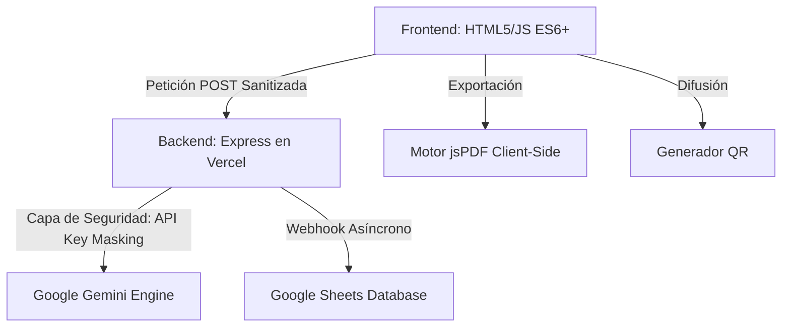

# Build with AI - ITCM 2026
## Programación Web [AEB-1055] - Plataforma de Innovación Tecnológica de Grado Industrial

---

## Acceso Rápido
**Sitio Web Oficial:** [build-with-ai-itcm.vercel.app](https://build-with-ai-itcm.vercel.app/)

---

## Tabla de Contenidos
1. [Introducción y Contexto](#introducción-y-contexto)
2. [Identidad Institucional y Ecosistema](#identidad-institucional-y-ecosistema)
3. [Metodología de Desarrollo](#metodología-de-desarrollo)
4. [Estrategia PWA (Progressive Web App) y Modo Offline](#estrategia-pwa-progressive-web-app-y-modo-offline)
5. [Análisis Detallado de Funcionalidades](#análisis-detallado-de-funcionalidades)
6. [Módulo de Exportación de Documentos (PDF)](#módulo-de-exportación-de-documentos-pdf)
7. [Generación de Acceso Rápido (QR Code)](#generación-de-acceso-rápido-qr-code)
8. [Arquitectura del Sistema y Flujo de Datos](#arquitectura-del-sistema-y-flujo-de-datos)
9. [Ingeniería de Backend: Clase AIRequestHandler](#ingeniería-de-backend-clase-airequesthandler)
10. [Ingeniería de Prompts (Prompt Engineering)](#ingeniería-de-prompts-prompt-engineering)
11. [Auditoría Técnica: IA y Desarrollo Web Moderno](#auditoría-técnica-ia-y-desarrollo-web-moderno)
12. [Seguridad y Hardening de la Aplicación](#seguridad-y-hardening-de-la-aplicación)
13. [Optimización de Performance, SEO y QA](#optimización-de-performance-seo-y-qa)
14. [Innovación en UI: Material Design 3 Floating Labels](#innovación-en-ui-material-design-3-floating-labels)
15. [Sistema de Feedback Visual Institucional (Confetti)](#sistema-de-feedback-visual-institucional-confetti)
16. [Sinergia Institucional y Branding](#sinergia-institucional-y-branding)
17. [Estructura del Proyecto y Glosario](#estructura-del-proyecto-y-glosario)
18. [Guía de Instalación, Configuración y Despliegue](#guía-de-instalación-configuración-y-despliegue)
19. [Roadmap y Futuras Implementaciones](#roadmap-y-futuras-implementaciones)
20. [Contribución y Licencia](#contribución-y-licencia)
21. [Autor](#autor)

---

## Introducción y Contexto

El repositorio **Build with AI - ITCM 2026** representa la culminación de un esfuerzo de desarrollo orientado a la excelencia académica y tecnológica. Esta plataforma ha sido diseñada como el núcleo operativo para la gestión de propuestas en el marco de la gira universitaria de **Google Developers**, la cual tendrá lugar en el **Instituto Tecnológico de Ciudad Madero** el próximo **25 de Mayo de 2026**.

A diferencia de las aplicaciones web convencionales, este sistema ha sido concebido bajo un paradigma de **Inteligencia Artificial Integrada**, donde el frontend y el backend colaboran no solo para almacenar información, sino para asistirla, validarla y mejorarla en tiempo real. Este proyecto se presenta como una solución soberana del **TecNM**, demostrando la capacidad de los estudiantes del ITCM para liderar la transformación digital regional.

---

## Identidad Institucional y Ecosistema

Este proyecto no es una entidad aislada, sino que forma parte de un ecosistema digital más amplio dedicado a la carrera de **Ingeniería en Sistemas Computacionales**. Su diseño y funcionalidad están intrínsecamente ligados al portal oficial de la carrera:

**Portal ISC-ITCM:** [jjho05.github.io/ISC-ITCM/](https://jjho05.github.io/ISC-ITCM/)

La alineación visual con los estándares de **Material Design 3** de Google, combinada con la sobriedad institucional del ITCM, garantiza que la plataforma proyecte una imagen de vanguardia y profesionalismo. Cada elemento, desde la paleta de colores hasta la tipografía, ha sido seleccionado para reforzar el sentido de pertenencia y el orgullo por nuestra institución.

---

## Metodología de Desarrollo

Para la realización de este proyecto se siguió un ciclo de vida de desarrollo de software (SDLC) iterativo, priorizando la agilidad y la calidad técnica:

1. **Análisis de Requerimientos:** Identificación de las necesidades de la comunidad estudiantil.
2. **Diseño de Arquitectura:** Definición del modelo de datos y la estrategia de seguridad.
3. **Desarrollo Frontend:** Implementación de una interfaz limpia y responsiva.
4. **Integración de IA:** Configuración y entrenamiento de prompts para el motor Gemini.
5. **Pruebas y QA:** Auditoría de seguridad y validación de la persistencia.

---

## Estrategia PWA (Progressive Web App) y Modo Offline

Para garantizar la accesibilidad durante el evento masivo en el ITCM:

- **Manifiesto de Aplicación:** Configuración de `manifest.json` para permitir la instalación como app nativa.
- **Service Worker (sw.js):** Estrategia de caché para carga instantánea de activos críticos.
- **Inmersión Móvil:** Integración cromática mediante la meta-etiqueta `theme-color`.

---

## Análisis Detallado de Funcionalidades

### 1. Motor de Captura y Persistencia
- **Validación Dinámica:** Análisis léxico en tiempo real para calidad institucional.
- **Draft Persistence:** Uso de `localStorage` para proteger los borradores de los usuarios.
- **Copy Proposal Logic:** Sistema de respaldo rápido mediante la API de portapapeles.

### 2. Gemini Assistant (Chatbot Contextual)
- **Quick Starter Prompts:** Botones interactivos para guiar al usuario en sus primeras consultas.
- **Feedback Visual:** Indicadores de escritura y estados de carga asíncronos.

---

## Módulo de Exportación de Documentos (PDF)

Se ha implementado una capa de generación de documentos dinámicos utilizando **jsPDF**:
- **Ficha Técnica Profesional:** Al enviar una propuesta, el usuario puede descargar un respaldo en PDF.
- **Diseño Estructural:** El PDF incluye un encabezado institucional, datos del autor, título del proyecto y el cuerpo de la propuesta formateado para lectura técnica.
- **Utilidad Académica:** Permite a los estudiantes del ITCM presentar sus ideas de forma física o digital con un formato estandarizado.

---

## Generación de Acceso Rápido (QR Code)

Para facilitar la difusión del evento en el **Gimnasio Auditorio del ITCM**:
- **Motor qrcode.js:** Generación instantánea de códigos QR dentro de la plataforma.
- **Modal Interactivo:** Una interfaz limpia que presenta el QR para que otros compañeros puedan escanearlo y unirse a la iniciativa de inmediato.

---

## Arquitectura del Sistema y Flujo de Datos

---

## Ingeniería de Backend: Clase AIRequestHandler

- **Constructor Modular:** Normalización de payloads.
- **Sanitización Dinámica:** Limpieza de inputs.
- **Pipeline de Datos:** Estructuración uniforme para IA y Bases de Datos.

---

## Ingeniería de Prompts (Prompt Engineering)

- **System Instruction:** Personalidad representativa de Build with AI ITCM.
- **Control de Formato:** Renderizado de Markdown mediante `marked.js`.
- **Sanitización UI:** Integración de **DOMPurify** para prevenir ataques XSS en respuestas de IA.

---

## Auditoría Técnica: IA y Desarrollo Web Moderno

- **Inferencia Probabilística:** Gestión de ventanas de contexto.
- **Latencia Optimizada:** TTFT (Time To First Token) minimizado.
- **Tokens de Diseño:** Uso de variables CSS para consistencia global.

---

## Seguridad y Hardening de la Aplicación

- **API Key Proxying:** Seguridad en el lado del servidor.
- **DOMPurify Sanitization:** Limpieza de datos dinámica.
- **Custom 404:** Página de error institucional personalizada.

---

## Optimización de Performance, SEO y QA

- **Open Graph (SEO):** Optimización para compartir en WhatsApp y Twitter con imágenes profesionales (`og-image.png`).
- **Lighthouse Scoring:** Alto rendimiento en accesibilidad y mejores prácticas.

---

## Innovación en UI: Material Design 3 Floating Labels

Se ha implementado un sistema de formularios de vanguardia:
- **Interactividad Fluida:** Las etiquetas de los campos se desplazan y escalan dinámicamente al recibir foco o contenido.
- **UX Intuitiva:** Mejora la legibilidad y reduce la carga cognitiva durante el llenado de propuestas.
- **Animaciones Suaves:** Uso de transiciones CSS cúbicas para una sensación de fluidez "premium".

---

## Sistema de Feedback Visual Institucional (Confetti)

El éxito en la plataforma no solo se registra, se celebra:
- **Canvas-Confetti Custom:** Motor de partículas personalizado.
- **Paleta Institucional:** El confetti utiliza exclusivamente los colores de Google y el verde esmeralda institucional del ITCM.

---

## Sinergia Institucional y Branding

El footer representa la alianza estratégica:
- **Google Developers:** Innovación global.
- **ITCM:** El logo del Instituto Tecnológico de Ciudad Madero se presenta en su **color institucional original**, con un tamaño destacado (**60px**) para reafirmar la identidad del TecNM.

---

## Estructura del Proyecto y Glosario

- `/public`: Activos estáticos.
  - `index.html`: Núcleo de la plataforma.
  - `404.html`: Página de error personalizada.
  - `sw.js`: PWA Service Worker.
- `server.js`: Lógica de negocio.

---

## Guía de Instalación, Configuración y Despliegue

1. Clonar repositorio.
2. `npm install`.
3. Configurar variables `.env`.
4. `npm run dev`.

---

## Roadmap y Futuras Implementaciones

- **Exportación masiva para administradores.**
- **Módulo de Realidad Aumentada para el QR.**
- **Integración con SIIT (Sistema Integral de Información Tecnológica).**

---

## Contribución y Licencia

**Licencia:** MIT.

---

## Autor

**Jesús Olvera**  
**Estudiante de Ingeniería en Sistemas Computacionales**  
Instituto Tecnológico de Ciudad Madero

- **Portal ISC-ITCM:** [jjho05.github.io/ISC-ITCM/](https://jjho05.github.io/ISC-ITCM/)  
- **GitHub:** [@jjho05](https://github.com/jjho05)
- **Email:** [jjho.reivaj05@gmail.com](mailto:jjho.reivaj05@gmail.com)

---

**Por mi Patria y por mi Bien**  
**Orgullo Tec Madero** 🦅

© 2026 - Tecnológico Nacional de México  
Instituto Tecnológico de Ciudad Madero
