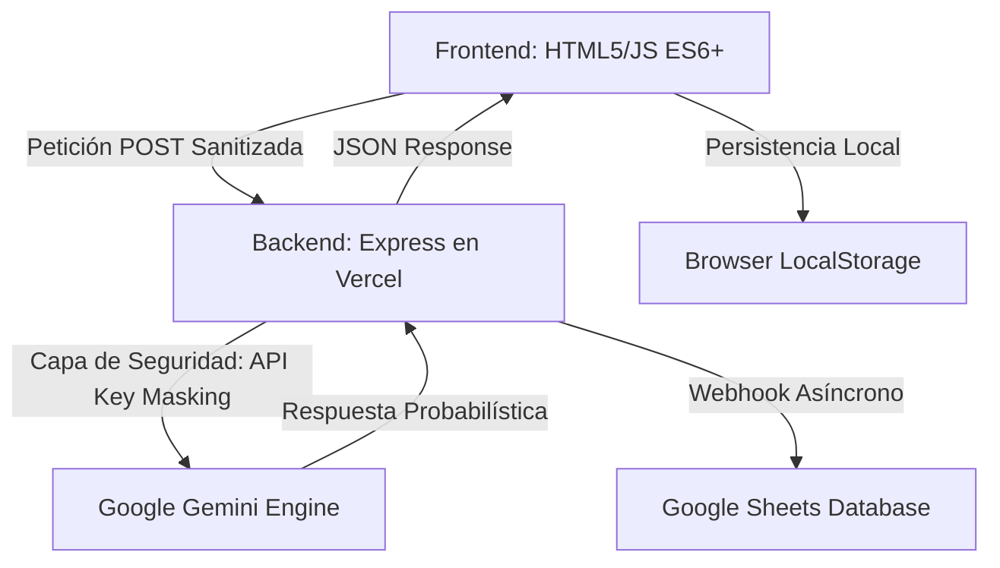

# Build with AI - ITCM 2026
## Programación Web [AEB-1055] - Plataforma de Innovación Tecnológica de Grado Industrial

---

## Acceso Rápido
**Sitio Web Oficial:** [build-with-ai-itcm.vercel.app](https://build-with-ai-itcm.vercel.app/)

---

## Tabla de Contenidos
1. [Introducción y Contexto](#introducción-y-contexto)
2. [Identidad Institucional y Ecosistema](#identidad-institucional-y-ecosistema)
3. [Metodología de Desarrollo](#metodología-de-desarrollo)
4. [Estrategia PWA (Progressive Web App) y Modo Offline](#estrategia-pwa-progressive-web-app-y-modo-offline)
5. [Análisis Detallado de Funcionalidades](#análisis-detallado-de-funcionalidades)
6. [Módulos de Productividad y UX de Grado Industrial](#módulos-de-productividad-y-ux-de-grado-industrial)
7. [Ecosistema de Evento Masivo y Difusión](#ecosistema-de-evento-masivo-y-difusión)
8. [Arquitectura del Sistema y Flujo de Datos](#arquitectura-del-sistema-y-flujo-de-datos)
9. [Ingeniería de Backend: Clase AIRequestHandler](#ingeniería-de-backend-clase-airequesthandler)
10. [Ingeniería de Prompts (Prompt Engineering)](#ingeniería-de-prompts-prompt-engineering)
11. [Auditoría Técnica: IA y Desarrollo Web Moderno](#auditoría-técnica-ia-y-desarrollo-web-moderno)
12. [Seguridad y Hardening de la Aplicación](#seguridad-y-hardening-de-la-aplicación)
13. [Optimización de Performance, SEO y QA](#optimización-de-performance-seo-y-qa)
14. [Diseño Responsivo, Accesibilidad y UX](#diseño-responsivo-accesibilidad-y-ux)
15. [Sinergia Institucional y Branding](#sinergia-institucional-y-branding)
16. [Estructura del Proyecto y Glosario](#estructura-del-proyecto-y-glosario)
17. [Guía de Instalación, Configuración y Despliegue](#guía-de-instalación-configuración-y-despliegue)
18. [Roadmap y Futuras Implementaciones](#roadmap-y-futuras-implementaciones)
19. [Contribución y Licencia](#contribución-y-licencia)
20. [Autor](#autor)

---

## Introducción y Contexto

El repositorio **Build with AI - ITCM 2026** representa la culminación de un esfuerzo de desarrollo orientado a la excelencia académica y tecnológica. Esta plataforma ha sido diseñada como el núcleo operativo para la gestión de propuestas en el marco de la gira universitaria de **Google Developers**, la cual tendrá lugar en el **Instituto Tecnológico de Ciudad Madero** el próximo **25 de Mayo de 2026**.

A diferencia de las aplicaciones web convencionales, este sistema ha sido concebido bajo un paradigma de **Inteligencia Artificial Integrada**, donde el frontend y el backend colaboran no solo para almacenar información, sino para asistirla, validarla y mejorarla en tiempo real. Este proyecto se presenta como una solución soberana del **TecNM**, demostrando la capacidad de los estudiantes del ITCM para liderar la transformación digital regional.

---

## Identidad Institucional y Ecosistema

Este proyecto no es una entidad aislada, sino que forma parte de un ecosistema digital más amplio dedicado a la carrera de **Ingeniería en Sistemas Computacionales**. Su diseño y funcionalidad están intrínsecamente ligados al portal oficial de la carrera:

**Portal ISC-ITCM:** [jjho05.github.io/ISC-ITCM/](https://jjho05.github.io/ISC-ITCM/)

La alineación visual con los estándares de **Material Design 3** de Google, combinada con la sobriedad institucional del ITCM, garantiza que la plataforma proyecte una imagen de vanguardia y profesionalismo. Cada elemento, desde la paleta de colores hasta la tipografía, ha sido seleccionado para reforzar el sentido de pertenencia y el orgullo por nuestra institución.

---

## Metodología de Desarrollo

Para la realización de este proyecto se siguió un ciclo de vida de desarrollo de software (SDLC) iterativo, priorizando la agilidad y la calidad técnica:

1. **Análisis de Requerimientos:** Identificación de las necesidades de la comunidad estudiantil y los requisitos técnicos de la gira Google Developers.
2. **Diseño de Arquitectura:** Definición del modelo de datos y la estrategia de seguridad para el manejo de APIs externas.
3. **Desarrollo Full-Stack:** Implementación de frontend responsivo y backend seguro en Node.js.
4. **Integración de IA:** Configuración y entrenamiento de prompts para el motor Gemini 3.0 Flash.
5. **Optimización UX/UI:** Implementación de micro-animaciones y patrones de diseño MD3.

---

## Estrategia PWA (Progressive Web App) y Modo Offline

Para garantizar que la plataforma sea accesible incluso en condiciones de baja conectividad durante el evento masivo en el ITCM, se ha implementado tecnología PWA:

- **Manifiesto de Aplicación:** Configuración de `manifest.json` con iconos de alta resolución (512x512) para permitir la instalación de la app en pantallas de inicio.
- **Service Worker (sw.js):** Implementación de una estrategia de almacenamiento en caché para activos críticos, asegurando cargas instantáneas.
- **Inmersión Móvil:** Uso de la meta-etiqueta `theme-color` para integrar la interfaz con el sistema operativo móvil.

---

## Análisis Detallado de Funcionalidades

La plataforma integra módulos avanzados que garantizan una experiencia de usuario de nivel comercial:

- **Validación Dinámica de Texto:** Análisis léxico en tiempo real para propuestas institucionales.
- **Gemini Assistant:** Chatbot contextual con botones de sugerencia rápida (**Quick Starter Prompts**).
- **Draft Persistence:** Guardado automático de borradores en `localStorage`.
- **FAQ Institucional:** Sección de preguntas frecuentes con información sobre la ubicación en el **Gimnasio Auditorio del ITCM**.

---

## Módulos de Productividad y UX de Grado Industrial

### 1. Exportación de Ficha Técnica (PDF)
Integración de la librería **jsPDF** para permitir que los estudiantes descarguen su propuesta en un formato PDF profesional. Este documento incluye un encabezado institucional, datos del autor, fecha de emisión y el cuerpo de la propuesta, sirviendo como un comprobante formal de participación académica.

### 2. Etiquetas Flotantes (Floating Labels MD3)
Implementación de un sistema de formularios reactivos donde las etiquetas se desplazan y transforman suavemente al interactuar con los campos de entrada. Este patrón de diseño, propio de **Material Design 3**, mejora significativamente la legibilidad y la estética del proceso de registro.

### 3. Feedback Visual Institucional
Uso de la librería `canvas-confetti` configurada con una paleta de colores personalizada: **Azul, Rojo, Amarillo y Verde de Google**, junto con el **Verde Esmeralda institucional del ITCM**, celebrando cada envío con identidad institucional.

---

## Ecosistema de Evento Masivo y Difusión

### Generador de Códigos QR Dinámicos
Para facilitar la difusión masiva durante la gira universitaria, la plataforma incluye un **Generador de QR** basado en `qrcode.js`. Este módulo permite:
- Desplegar un código QR de alta fidelidad en pantallas gigantes o dispositivos móviles.
- Facilitar el acceso instantáneo a los estudiantes sin necesidad de teclear la URL manualmente.
- Fomentar la participación orgánica y rápida durante el evento en el **Gimnasio Auditorio**.

---

## Arquitectura del Sistema y Flujo de Datos

La arquitectura sigue un modelo **Serverless Proxy Pattern**, diseñado para maximizar la seguridad:

---

## Ingeniería de Backend: Clase AIRequestHandler

El backend utiliza un patrón de Programación Orientada a Objetos (OOP) para la gestión de solicitudes. La clase `AIRequestHandler` centraliza la lógica de:
- **Sanitización Dinámica:** Limpieza de inputs mediante regex y validación de tipos.
- **Pipeline de Datos:** Orquestación de peticiones entre la IA y el almacenamiento persistente.

---

## Ingeniería de Prompts (Prompt Engineering)

El asistente de IA ha sido entrenado para actuar como un guía experto en el ecosistema de Google y el ITCM:
- **Sanitización UI:** Integración de **DOMPurify** para prevenir ataques XSS en las respuestas generadas.
- **Formateo Markdown:** Renderizado dinámico de respuestas enriquecidas mediante `marked.js`.

---

## Auditoría Técnica: IA y Desarrollo Web Moderno

### 1. Inferencia vs. Consulta Tradicional
Transición del determinismo tradicional al **Probabilismo** de la IA generativa, gestionado mediante ventanas de contexto masivas.

### 2. Time To First Token (TTFT)
Optimización de la latencia para una respuesta "instantánea" del asistente.

---

## Seguridad y Hardening de la Aplicación

- **API Key Proxying:** Protección total de secretos en el lado del servidor.
- **DOMPurify Integration:** Sanitización obligatoria en el cliente.
- **Personalized 404:** Página de error institucional (`404.html`) diseñada para mantener al usuario dentro del ecosistema.

---

## Optimización de Performance, SEO y QA

- **Open Graph (SEO):** Implementación de etiquetas para previsualización enriquecida en redes sociales.
- **Asset Optimization:** Uso de `og-image.png` de alta fidelidad y logotipos vectoriales.

---

## Sinergia Institucional y Branding

El footer de la plataforma representa la alianza estratégica:
- **Google Developers:** Logo oficial con transparencia institucional.
- **ITCM:** Logo en su **color institucional original**, con un tamaño destacado (**60px**) para reafirmar la soberanía del TecNM.

---

## Estructura del Proyecto

- `/public`: 
  - `index.html`, `contacto.html`, `404.html`.
  - `sw.js`, `manifest.json`.
  - `logo-itcm.png`, `og-image.png`.
- `server.js`: Lógica de backend.

---

## Guía de Instalación y Despliegue

1. Clonar: `git clone https://github.com/jjho05/build-with-ai-itcm.git`
2. Instalar: `npm install`
3. Configurar `.env`: `GEMINI_API_KEY` y `GOOGLE_SHEET_WEBHOOK_URL`.
4. Ejecutar: `npm run dev`

---

## Roadmap y Futuras Implementaciones

- **Autenticación Institucional.**
- **Dashboard de Administrador.**

---

## Contribución y Licencia

**Licencia:** MIT.

---

## Autor

**Jesús Olvera**  
**Estudiante de Ingeniería en Sistemas Computacionales**  
Instituto Tecnológico de Ciudad Madero

- **Portal de la Carrera (ISC-ITCM):** [jjho05.github.io/ISC-ITCM/](https://jjho05.github.io/ISC-ITCM/)  
- **GitHub:** [@jjho05](https://github.com/jjho05)
- **Email:** [jjho.reivaj05@gmail.com](mailto:jjho.reivaj05@gmail.com)

---

**Por mi Patria y por mi Bien**  
**Orgullo Tec Madero** 🦅

© 2026 - Tecnológico Nacional de México  
Instituto Tecnológico de Ciudad Madero
