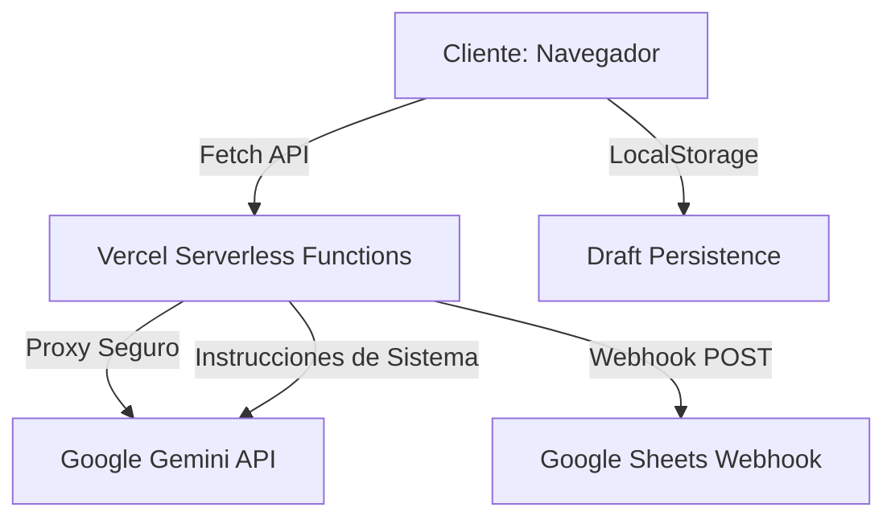

# 🚀 Build with AI - ITCM 2026
## Programación Web [AEB-1055] - Plataforma de Innovación Tecnológica

---

## 📖 Tabla de Contenidos
1. [Introducción](#-introducción)
2. [Identidad Institucional](#-identidad-institucional)
3. [Características Principales](#-características-principales)
4. [Arquitectura del Sistema](#-arquitectura-del-sistema)
5. [Auditoría Técnica y Fundamentos de IA](#-auditoría-técnica-y-fundamentos-de-ia)
6. [Estructura del Proyecto](#-estructura-del-proyecto)
7. [Guía de Instalación y Despliegue](#-guía-de-instalación-y-despliegue)
8. [Seguridad y Hardening](#-seguridad-y-hardening)
9. [Créditos y Autoría](#-créditos-y-autoría)

---

## 📖 Introducción

Bienvenido al repositorio **Build with AI - ITCM 2026**, una plataforma Full-Stack de alto rendimiento diseñada para la gestión integral de la gira oficial de **Google Developers** en el **Instituto Tecnológico de Ciudad Madero**. 

Este proyecto no solo cumple con los objetivos académicos de la materia de **Programación Web**, sino que actúa como una solución soberana para capturar el talento y la innovación de la comunidad del **TecNM**. El evento central está programado para el **25 de Mayo de 2026**, y esta web es el núcleo de toda la operación.

---

## 🏛️ Identidad Institucional

Este proyecto está profundamente arraigado en la cultura del **ITCM**. Se ha diseñado para ser el complemento perfecto del portal oficial de la carrera:

**👉 Portal ISC-ITCM:** [jjho05.github.io/ISC-ITCM/](https://jjho05.github.io/ISC-ITCM/)

> [!IMPORTANT]
> **Visión de Excelencia:**  
> La identidad visual, los colores y el tono de voz de esta plataforma han sido curados para reflejar el prestigio del **Instituto Tecnológico de Ciudad Madero**, alineándose con la visión de profesionalización digital impulsada por **Jesús Olvera**.

---

## 💎 Características Principales

### 🌑 Interfaz Premium (Material 3)
- **Modo Oscuro/Claro:** Implementación nativa con persistencia en `localStorage`.
- **Google Top Loader:** Barra de progreso multicolor que indica actividad asíncrona.
- **Scroll Reveal:** Animaciones basadas en `Intersection Observer` para una navegación fluida.
- **Countdown Timer:** Contador en tiempo real hacia el **25 de Mayo**.

### 🤖 Inteligencia Artificial (Gemini Core)
- **Chatbot Contextual:** Asistente integrado con Gemini 1.5 Flash.
- **AI Tips:** Sistema de rotación de consejos para ayudar a los estudiantes a redactar mejores propuestas.
- **Análisis de Texto:** Validación dinámica de longitud y calidad de las propuestas.

### 📊 Gestión de Datos y Webhooks
- **Google Sheets Sync:** Conexión directa mediante Webhooks para el almacenamiento centralizado.
- **Clasificación Automática:** El sistema distingue entre propuestas académicas y consultas generales.

---

## 🏗️ Arquitectura del Sistema



### Tecnologías Utilizadas:
- **Frontend:** HTML5 Semántico, CSS3 Moderno (Variables, Flex, Grid), JS ES6+.
- **Backend:** Node.js, Express.
- **IA:** Google Generative AI SDK (Gemini).
- **Hosting:** Vercel (Optimizado para Serverless).

---

## 🧠 Auditoría Técnica y Fundamentos de IA

### 1. APIs Probabilísticas vs. Deterministas
En este proyecto, se documenta la transición de la programación tradicional (donde una entrada siempre genera la misma salida) a la **Programación con IA**. Gemini opera en un espacio probabilístico, lo que requiere un **Prompt Engineering** cuidadoso para mantener la consistencia institucional.

### 2. Seguridad de Grado Industrial
El uso de un **Backend Proxy** en `server.js` es crítico. Exponer la API Key de Google en el frontend resultaría en una vulnerabilidad grave. Nuestro servidor actúa como un guardián, protegiendo las credenciales y sanitizando los datos antes de procesarlos.

### 3. Optimización de Rendimiento
- **TTFT (Time To First Token):** El chat está optimizado para una respuesta rápida.
- **Bundle Size:** No se utilizan frameworks pesados; la aplicación es ligera y carga en milisegundos.

---

## 🛠️ Estructura del Proyecto

- `server.js`: Núcleo del servidor, gestiona la lógica de IA y la comunicación con Google Sheets.
- `public/index.html`: Interfaz principal con sistema de diseño Material 3.
- `public/contacto.html`: Página de información institucional y soporte.
- `public/style.css`: Sistema de tokens de diseño, animaciones y modo oscuro.
- `vercel.json`: Configuración de rutas y despliegue serverless.
- `package.json`: Definición de dependencias (Express, SDK de Gemini).

---

## 🛠️ Guía de Instalación y Despliegue

### Requisitos Previos:
- Node.js v18+.
- Una API Key de Google AI Studio.
- URL de un Webhook de Google Sheets.

### Pasos:
1. Clonar: `git clone https://github.com/jjho05/build-with-ai-itcm.git`
2. Instalar: `npm install`
3. Configurar `.env`:
   ```env
   GEMINI_API_KEY=tu_llave_aqui
   GOOGLE_SHEET_WEBHOOK_URL=tu_url_aqui
   ```
4. Iniciar: `npm run dev`

---

## 👨‍💻 Autoría y Orgullo Madero

Este proyecto ha sido desarrollado íntegramente por:

**Jesús Javier Hernández Olvera**  
Ingeniería en Sistemas Computacionales  
**Instituto Tecnológico de Ciudad Madero**

- **GitHub:** [@jjho05](https://github.com/jjho05)
- **LinkedIn:** [Jesús Olvera](https://www.linkedin.com/in/jjhernandezolvera/)

---

**"Por mi Patria y por mi Bien"**  
**Instituto Tecnológico de Ciudad Madero** 🦅  
© 2026 - Proyecto de Innovación para Programación Web
