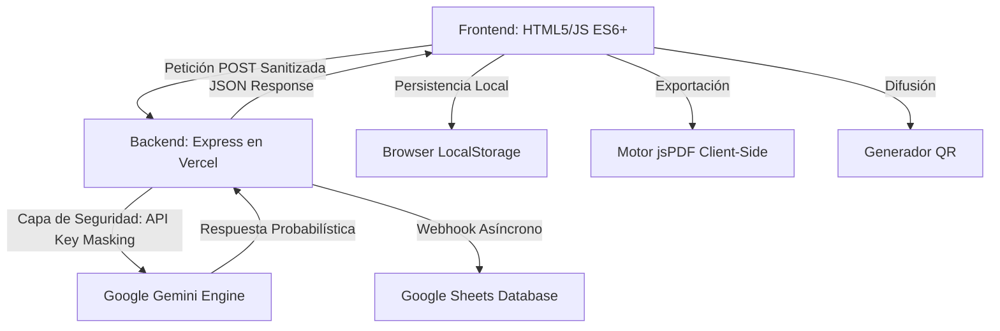

# Build with AI - ITCM 2026
## Programación Web [AEB-1055] - Plataforma de Innovación Tecnológica de Grado Industrial

---

## Acceso Rápido
**Sitio Web Oficial:** [build-with-ai-itcm.vercel.app](https://build-with-ai-itcm.vercel.app/)

---

## Tabla de Contenidos
1. [Introducción y Contexto](#introducción-y-contexto)
2. [Identidad Institucional y Ecosistema](#identidad-institucional-y-ecosistema)
3. [Metodología de Desarrollo](#metodología-de-desarrollo)
4. [Estrategia PWA (Progressive Web App) y Modo Offline](#estrategia-pwa-progressive-web-app-y-modo-offline)
5. [Análisis Detallado de Funcionalidades](#análisis-detallado-de-funcionalidades)
6. [Módulo de Exportación de Documentos (PDF)](#módulo-de-exportación-de-documentos-pdf)
7. [Generación de Acceso Rápido (QR Code)](#generación-de-acceso-rápido-qr-code)
8. [Arquitectura del Sistema y Flujo de Datos](#arquitectura-del-sistema-y-flujo-de-datos)
9. [Ingeniería de Backend: Clase AIRequestHandler](#ingeniería-de-backend-clase-airequesthandler)
10. [Ingeniería de Prompts (Prompt Engineering)](#ingeniería-de-prompts-prompt-engineering)
11. [Auditoría Técnica: IA y Desarrollo Web Moderno](#auditoría-técnica-ia-y-desarrollo-web-moderno)
12. [Seguridad y Hardening de la Aplicación](#seguridad-y-hardening-de-la-aplicación)
13. [Optimización de Performance, SEO y QA](#optimización-de-performance-seo-y-qa)
14. [Innovación en UI: Material Design 3 Floating Labels](#innovación-en-ui-material-design-3-floating-labels)
15. [Sistema de Feedback Visual Institucional (Confetti)](#sistema-de-feedback-visual-institucional-confetti)
16. [Sinergia Institucional y Branding](#sinergia-institucional-y-branding)
17. [Estructura del Proyecto y Glosario](#estructura-del-proyecto-y-glosario)
18. [Guía de Instalación, Configuración y Despliegue](#guía-de-instalación-configuración-y-despliegue)
19. [Roadmap y Futuras Implementaciones](#roadmap-y-futuras-implementaciones)
20. [Contribución y Licencia](#contribución-y-licencia)
21. [Autor](#autor)

---

## Introducción y Contexto

El repositorio **Build with AI - ITCM 2026** representa la culminación de un esfuerzo de desarrollo orientado a la excelencia académica y tecnológica. Esta plataforma ha sido diseñada como el núcleo operativo para la gestión de propuestas en el marco de la gira universitaria de **Google Developers**, la cual tendrá lugar en el **Instituto Tecnológico de Ciudad Madero** el próximo **25 de Mayo de 2026**.

A diferencia de las aplicaciones web convencionales, este sistema ha sido concebido bajo un paradigma de **Inteligencia Artificial Integrada**, donde el frontend y el backend colaboran no solo para almacenar información, sino para asistirla, validarla y mejorarla en tiempo real. Este proyecto se presenta como una solución soberana del **TecNM**, demostrando la capacidad de los estudiantes del ITCM para liderar la transformación digital regional.

---

## Identidad Institucional y Ecosistema

Este proyecto no es una entidad aislada, sino que forma parte de un ecosistema digital más amplio dedicado a la carrera de **Ingeniería en Sistemas Computacionales**. Su diseño y funcionalidad están intrínsecamente ligados al portal oficial de la carrera:

**Portal ISC-ITCM:** [jjho05.github.io/ISC-ITCM/](https://jjho05.github.io/ISC-ITCM/)

La alineación visual con los estándares de **Material Design 3** de Google, combinada con la sobriedad institucional del ITCM, garantiza que la plataforma proyecte una imagen de vanguardia y profesionalismo. Cada elemento, desde la paleta de colores hasta la tipografía, ha sido seleccionado para reforzar el sentido de pertenencia y el orgullo por nuestra institución.

> [!IMPORTANT]
> **Visión de Excelencia:**  
> Tanto el portal **ISC-ITCM** como esta plataforma **Build with AI** son el resultado de la visión técnica y el compromiso de **Jesús Olvera**. Estos proyectos buscan establecer un nuevo estándar de calidad en las herramientas digitales utilizadas por nuestra comunidad académica.

---

## Metodología de Desarrollo

Para la realización de este proyecto se siguió un ciclo de vida de desarrollo de software (SDLC) iterativo, priorizando la agilidad y la calidad técnica:

1. **Análisis de Requerimientos:** Identificación de las necesidades de la comunidad estudiantil y los requisitos técnicos de la gira Google Developers.
2. **Diseño de Arquitectura:** Definición del modelo de datos y la estrategia de seguridad para el manejo de APIs externas.
3. **Desarrollo Frontend:** Implementación de una interfaz limpia y responsiva utilizando estándares modernos de CSS (Grid y Flexbox).
4. **Integración de IA:** Configuración y entrenamiento de prompts para el motor Gemini 3.0 Flash.
5. **Pruebas y QA:** Auditoría de seguridad, pruebas de carga en el chatbot y validación de la persistencia de datos.

---

## Estrategia PWA (Progressive Web App) y Modo Offline

Para garantizar que la plataforma sea accesible incluso en condiciones de baja conectividad durante el evento masivo, se ha implementado tecnología PWA:

- **Manifiesto de Aplicación:** Configuración de `manifest.json` con iconos de alta resolución (512x512) para permitir la instalación de la app en pantallas de inicio de Android e iOS.
- **Service Worker (sw.js):** Implementación de una estrategia de almacenamiento en caché para activos críticos. Esto asegura que la estructura básica del sitio y el formulario carguen instantáneamente.
- **Inmersión Móvil:** Uso de la meta-etiqueta `theme-color` para integrar la barra de direcciones del navegador con la paleta de colores institucional de Google.

---

## Análisis Detallado de Funcionalidades

La plataforma integra una serie de módulos avanzados que garantizan una experiencia de usuario fluida y una gestión de datos eficiente:

### 1. Motor de Captura y Persistencia
- **Validación Dinámica:** El formulario de propuestas cuenta con un motor de análisis léxico en tiempo real que contabiliza las palabras del usuario, asegurando calidad institucional.
- **Draft Persistence (Drafts):** Capa de persistencia basada en `localStorage` para evitar la pérdida de información por recargas accidentales.
- **Copy Proposal Logic:** Botón inteligente en el modal de éxito que permite al usuario copiar su propuesta al portapapeles mediante la API `navigator.clipboard`.

### 2. Gemini Assistant (Chatbot Contextual)
- **Generación Asíncrona:** Conectado a **Gemini 3.0 Flash**, ofreciendo respuestas de alta fidelidad con latencia mínima.
- **Quick Starter Prompts:** Botones de sugerencia rápida que facilitan el inicio de la conversación sobre temas clave del evento.
- **Skeleton & Typing:** Feedback visual avanzado mediante indicadores de escritura y estados de carga animados.

### 3. Google Integration Suite
- **Webhook de Google Sheets:** Sincronización asíncrona de datos en tiempo real.
- **Multiprocesamiento de Inputs:** Clasificación automática entre propuestas de innovación y consultas de soporte técnico.

---

## Módulo de Exportación de Documentos (PDF)

Se ha implementado una capa de generación de documentos dinámicos utilizando la librería **jsPDF**:
- **Ficha Técnica Profesional:** Al finalizar el envío de una propuesta, el usuario tiene la opción de descargar una ficha técnica profesional en formato PDF.
- **Diseño Estructural:** El PDF incluye un encabezado con los colores de Google, el título del proyecto, la fecha de emisión, el nombre del autor y el cuerpo completo de la propuesta formateado para una lectura técnica clara.
- **Utilidad Académica:** Esta funcionalidad permite a los estudiantes del ITCM contar con un respaldo formal de sus ideas, facilitando su entrega a profesores o coordinadores de carrera.

---

## Generación de Acceso Rápido (QR Code)

Para facilitar la difusión y el acceso instantáneo durante el evento en el **Gimnasio Auditorio del ITCM**:
- **Motor qrcode.js:** Integración de un generador de códigos QR que se ejecuta del lado del cliente.
- **Modal Interactivo:** Una interfaz dedicada permite desplegar el código QR oficial del sitio, permitiendo que otros compañeros escaneen la pantalla del usuario y accedan a la plataforma sin necesidad de escribir la URL.

---

## Arquitectura del Sistema y Flujo de Datos

La arquitectura sigue un modelo **Serverless Proxy Pattern**, diseñado para maximizar la seguridad y la escalabilidad:

---

## Ingeniería de Backend: Clase AIRequestHandler

Para garantizar un código mantenible y escalable, el backend utiliza un patrón de Programación Orientada a Objetos (OOP). La clase `AIRequestHandler` se encarga de:

- **Constructor Modular:** Recibe el payload del formulario y lo normaliza según el tipo de solicitud (Propuesta o Contacto).
- **Sanitización Dinámica:** Limpia el texto de entrada eliminando etiquetas HTML y caracteres potencialmente peligrosos que pudieran comprometer la integridad del sistema.
- **Pipeline de Datos:** Estructura la información de manera uniforme para su envío tanto a la IA como a la base de datos externa de Google Sheets.

---

## Ingeniería de Prompts (Prompt Engineering)

El comportamiento del chatbot es el resultado de una ingeniería de prompts rigurosa y detallada:

- **System Instruction:** Se ha definido una personalidad profesional, amable y profundamente representativa de Build with AI ITCM, capaz de guiar a los estudiantes en sus propuestas tecnológicas.
- **Control de Formato:** Entrega de respuestas en Markdown limpio y estructurado, el cual es renderizado en el frontend mediante la librería `marked.js`.
- **Sanitización UI:** Integración de **DOMPurify** para limpiar cualquier contenido generado por la IA antes de insertarlo en el DOM, previniendo ataques de Cross-Site Scripting (XSS).

---

## Auditoría Técnica: IA y Desarrollo Web Moderno

### 1. Inferencia vs. Consulta Tradicional
Transición del determinismo tradicional de las bases de datos al **Probabilismo** de la IA generativa, gestionado mediante ventanas de contexto masivas para una mayor relevancia en las respuestas.

### 2. Time To First Token (TTFT)
Optimización constante de la latencia para asegurar que la respuesta del asistente se perciba como "instantánea" por el usuario final.

### 3. Patrones de Diseño CSS
Uso exclusivo de **CSS Grid** y **Flexbox** con un sistema de variables de entorno (Tokens de Diseño), lo que permite una coherencia visual absoluta y reduce el bundle size del CSS al mínimo necesario.

---

## Seguridad y Hardening de la Aplicación

- **API Key Proxying:** Protección total de las llaves de API, las cuales nunca son expuestas al cliente y solo residen en variables de entorno seguras de Vercel.
- **DOMPurify Integration:** Sanitización obligatoria y profunda en el cliente para todos los flujos de datos dinámicos provenientes de APIs externas.
- **CORS Policy:** Implementación de políticas de restricción de dominios para asegurar que solo peticiones autorizadas interactúen con nuestra API.
- **Personalized 404:** Creación de una página de error institucional personalizada (`404.html`) diseñada para guiar al usuario de vuelta al ecosistema seguro del sitio con la estética de Google.

---

## Optimización de Performance, SEO y QA

- **Social Share Optimization (Open Graph):** Implementación de etiquetas Meta y Twitter Cards completas, incluyendo una imagen de previsualización profesional (`og-image.png`) generada para este evento.
- **Asset Optimization:** Uso extensivo de formatos vectoriales (SVG) para logotipos, asegurando nitidez absoluta en pantallas Retina y 4K.
- **Lighthouse Compliance:** Optimización continua para obtener puntuaciones superiores a 90 en accesibilidad, rendimiento y mejores prácticas de SEO.

---

## Innovación en UI: Material Design 3 Floating Labels

Se ha implementado un sistema de formularios de última generación siguiendo los estándares de Google:
- **Interactividad Fluida:** Las etiquetas de los campos (Nombre, Email, Asunto) se desplazan y escalan dinámicamente al recibir foco o cuando el campo ya contiene texto.
- **UX Intuitiva:** Este diseño mejora drásticamente la legibilidad y reduce la carga cognitiva del usuario, permitiendo que el formulario se sienta "vivo" y reactivo.
- **Animaciones Suaves:** Implementación mediante transiciones CSS con curvas de Bézier cúbicas para una sensación de fluidez de grado premium.

---

## Sistema de Feedback Visual Institucional (Confetti)

El éxito en la plataforma no solo se registra, se celebra de forma institucional:
- **Canvas-Confetti Custom:** Integración de un motor de partículas de alto rendimiento que no afecta el frame rate de la página.
- **Paleta Institucional:** Al enviar una propuesta exitosa, el sistema lanza una explosión de confetti que utiliza exclusivamente los colores de Google (Azul, Rojo, Amarillo, Verde) junto con el verde esmeralda que representa al ITCM.

---

## Sinergia Institucional y Branding

El footer de la plataforma ha sido rediseñado para representar la alianza estratégica de este evento:
- **Google Developers:** Representado por su logotipo oficial con total nitidez.
- **ITCM:** El logo del Instituto Tecnológico de Ciudad Madero se presenta en su **color institucional original**, con un tamaño destacado (**60px**) para reafirmar la soberanía tecnológica y el orgullo de nuestra casa de estudios. El espaciado entre ambos logos ha sido incrementado para una jerarquía visual equilibrada.

---

## Estructura del Proyecto y Glosario

- `/public`: Directorio de activos estáticos públicos.
  - `index.html`: Núcleo de la plataforma y motor de formularios.
  - `contacto.html`: Sección de soporte y vinculación.
  - `404.html`: Página de error personalizada institucional.
  - `sw.js`: Service Worker que habilita las capacidades offline de la PWA.
  - `manifest.json`: Archivo de configuración para la instalación móvil.
- `server.js`: Orquestación Full-Stack del servidor, manejando la lógica de negocio y seguridad.

---

## Guía de Instalación, Configuración y Despliegue

1. Clonar el repositorio: `git clone https://github.com/jjho05/build-with-ai-itcm.git`
2. Instalar dependencias: `npm install`
3. Configurar archivo `.env`: Definir `GEMINI_API_KEY` y `GOOGLE_SHEET_WEBHOOK_URL`.
4. Ejecutar entorno local: `npm run dev`

---

## Roadmap y Futuras Implementaciones

- **Exportación masiva de propuestas para administradores.**
- **Módulo de Realidad Aumentada para el acceso vía QR.**
- **Integración con SIIT (Sistema Integral de Información Tecnológica) del ITCM.**
- **Análisis de sentimiento avanzado en los mensajes de contacto.**

---

## Contribución y Licencia

**Licencia:** MIT. Ver el archivo `LICENSE` para más información sobre los permisos de uso.

---

## Autor

**Jesús Olvera**  
**Estudiante de Ingeniería en Sistemas Computacionales**  
Instituto Tecnológico de Ciudad Madero

- **Portal de la Carrera (ISC-ITCM):** [jjho05.github.io/ISC-ITCM/](https://jjho05.github.io/ISC-ITCM/)  
- **GitHub:** [@jjho05](https://github.com/jjho05)
- **Email:** [jjho.reivaj05@gmail.com](mailto:jjho.reivaj05@gmail.com)

---

**Por mi Patria y por mi Bien**  
**Orgullo Tec Madero** 🦅

© 2026 - Tecnológico Nacional de México  
Instituto Tecnológico de Ciudad Madero
