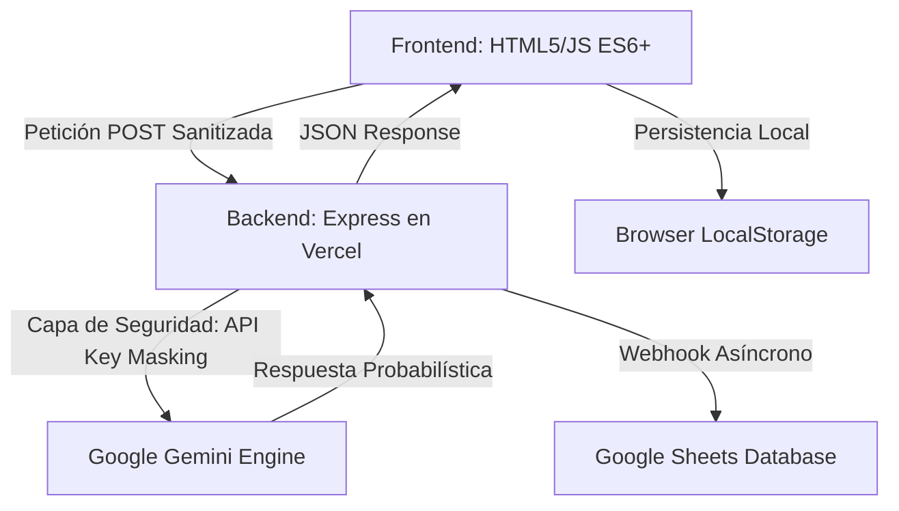

# Build with AI - ITCM 2026
## Programación Web [AEB-1055] - Plataforma de Innovación Tecnológica de Grado Industrial

---

## Tabla de Contenidos
1. [Introducción y Contexto](#introducción-y-contexto)
2. [Identidad Institucional y Ecosistema](#identidad-institucional-y-ecosistema)
3. [Metodología de Desarrollo](#metodología-de-desarrollo)
4. [Análisis Detallado de Funcionalidades](#análisis-detallado-de-funcionalidades)
5. [Arquitectura del Sistema y Flujo de Datos](#arquitectura-del-sistema-y-flujo-de-datos)
6. [Ingeniería de Backend: Clase AIRequestHandler](#ingeniería-de-backend-clase-airequesthandler)
7. [Auditoría Técnica: IA y Desarrollo Web Moderno](#auditoría-técnica-ia-y-desarrollo-web-moderno)
8. [Seguridad y Hardening de la Aplicación](#seguridad-y-hardening-de-la-aplicación)
9. [Diseño Responsivo y Experiencia de Usuario](#diseño-responsivo-y-experiencia-de-usuario)
10. [Estructura del Proyecto y Glosario](#estructura-del-proyecto-y-glosario)
11. [Guía de Instalación, Configuración y Despliegue](#guía-de-instalación-configuración-y-despliegue)
12. [Roadmap y Futuras Implementaciones](#roadmap-y-futuras-implementaciones)
13. [Autor](#autor)

---

## Introducción y Contexto

El repositorio **Build with AI - ITCM 2026** representa la culminación de un esfuerzo de desarrollo orientado a la excelencia académica y tecnológica. Esta plataforma ha sido diseñada como el núcleo operativo para la gestión de propuestas en el marco de la gira universitaria de **Google Developers**, la cual tendrá lugar en el **Instituto Tecnológico de Ciudad Madero** el próximo **25 de Mayo de 2026**.

A diferencia de las aplicaciones web convencionales, este sistema ha sido concebido bajo un paradigma de **Inteligencia Artificial Integrada**, donde el frontend y el backend colaboran no solo para almacenar información, sino para asistirla, validarla y mejorarla en tiempo real. Este proyecto se presenta como una solución soberana del **TecNM**, demostrando la capacidad de los estudiantes del ITCM para liderar la transformación digital regional.

---

## Identidad Institucional y Ecosistema

Este proyecto no es una entidad aislada, sino que forma parte de un ecosistema digital más amplio dedicado a la carrera de **Ingeniería en Sistemas Computacionales**. Su diseño y funcionalidad están intrínsecamente ligados al portal oficial de la carrera:

**Portal ISC-ITCM:** [jjho05.github.io/ISC-ITCM/](https://jjho05.github.io/ISC-ITCM/)

La alineación visual con los estándares de **Material Design 3** de Google, combinada con la sobriedad institucional del ITCM, garantiza que la plataforma proyecte una imagen de vanguardia y profesionalismo. Cada elemento, desde la paleta de colores hasta la tipografía, ha sido seleccionado para reforzar el sentido de pertenencia y el orgullo por nuestra institución.

> [!IMPORTANT]
> **Visión de Excelencia:**  
> Tanto el portal **ISC-ITCM** como esta plataforma **Build with AI** son el resultado de la visión técnica y el compromiso de **Jesús Olvera**. Estos proyectos buscan establecer un nuevo estándar de calidad en las herramientas digitales utilizadas por nuestra comunidad académica.

---

## Metodología de Desarrollo

Para la realización de este proyecto se siguió un ciclo de vida de desarrollo de software (SDLC) iterativo, priorizando la agilidad y la calidad técnica:

1. **Análisis de Requerimientos:** Identificación de las necesidades de la comunidad estudiantil y los requisitos técnicos de la gira Google Developers.
2. **Diseño de Arquitectura:** Definición del modelo de datos y la estrategia de seguridad para el manejo de APIs externas.
3. **Desarrollo Frontend:** Implementación de una interfaz limpia y responsiva utilizando estándares modernos de CSS (Grid y Flexbox).
4. **Integración de IA:** Configuración y entrenamiento de prompts para el motor Gemini 3.0 Flash.
5. **Pruebas y QA:** Auditoría de seguridad, pruebas de carga en el chatbot y validación de la persistencia de datos.

---

## Análisis Detallado de Funcionalidades

La plataforma integra una serie de módulos avanzados que garantizan una experiencia de usuario fluida y una gestión de datos eficiente:

### 1. Motor de Captura y Persistencia
- **Validación Dinámica:** El formulario de propuestas cuenta con un motor de análisis léxico en tiempo real que contabiliza las palabras del usuario, asegurando que las propuestas cumplan con un estándar mínimo de calidad y detalle (10 palabras).
- **Draft Persistence (Drafts):** Implementación de una capa de persistencia basada en `localStorage`. Esta funcionalidad asegura que, en caso de un fallo en la conexión o recarga accidental de la página, los datos capturados se conserven íntegros.
- **AI Tips System:** Un sistema rotativo de consejos inteligentes que orienta al estudiante sobre cómo redactar propuestas de impacto.

### 2. Gemini Assistant (Chatbot Contextual)
- **Generación Asíncrona:** Conectado a **Gemini 3.0 Flash**, el asistente ofrece respuestas de alta fidelidad con una latencia mínima.
- **Skeleton Loading:** Implementación de estados de carga animados que proporcionan feedback visual inmediato.
- **Typing Indicator:** Un simulador de escritura que humaniza la interacción con el bot.

### 3. Google Integration Suite
- **Webhook de Google Sheets:** Integración nativa para el almacenamiento de datos en tiempo real.
- **Multiprocesamiento de Inputs:** El backend diferencia y procesa tanto propuestas de proyectos como mensajes de contacto institucional.

### 4. Estética y Micro-animaciones
- **Google Top Loader:** Barra de carga superior multicolor sincronizada con las peticiones fetch.
- **Scroll Reveal Animations:** Uso del `Intersection Observer API` para desencadenar animaciones de entrada.
- **Modo Oscuro Adaptativo:** Sistema de temas con persistencia mediante atributos de datos de HTML5.

---

## Arquitectura del Sistema y Flujo de Datos

La arquitectura sigue un modelo **Serverless Proxy Pattern**:

---

## Ingeniería de Backend: Clase AIRequestHandler

Para garantizar un código mantenible y escalable, el backend utiliza un patrón de Programación Orientada a Objetos (OOP). La clase `AIRequestHandler` se encarga de:

- **Constructor Modular:** Recibe el payload del formulario (nombre, email, título, propuesta/mensaje).
- **Sanitización Dinámica:** Limpia el texto de entrada eliminando etiquetas HTML y caracteres potencialmente peligrosos.
- **Lógica de Validación:** Calcula el conteo de palabras y valida si el mensaje cumple con los requisitos mínimos según el tipo de entrada.
- **Pipeline de Datos:** Estructura la información de manera uniforme para su envío tanto a la IA como a la base de datos externa.

---

## Auditoría Técnica: IA y Desarrollo Web Moderno

### 1. Inferencia vs. Consulta Tradicional
En el desarrollo web estándar, una API entrega datos estáticos (Determinismo). En esta plataforma, la integración con Gemini introduce el **Probabilismo**, donde la respuesta se genera en tiempo real basándose en una ventana de contexto masiva.

### 2. Time To First Token (TTFT)
El rendimiento del chatbot se mide en la velocidad con la que entrega la primera unidad de información. Se ha minimizado el overhead del servidor para garantizar una experiencia "instantánea".

### 3. Patrones de Diseño CSS
El uso de variables de diseño (Tokens) permite una consistencia visual absoluta. No se utilizaron frameworks de terceros, lo que reduce el tiempo de carga y mejora el SEO.

---

## Seguridad y Hardening de la Aplicación

- **API Key Proxying:** Las llaves de API nunca son expuestas al cliente. Todo el procesamiento se realiza en el servidor.
- **Environment Variables:** Gestión de secretos mediante el entorno de Vercel.
- **Sanitización de Entradas:** Implementación de expresiones regulares para limpiar los inputs del usuario antes de cualquier procesamiento posterior.

---

## Diseño Responsivo y Experiencia de Usuario

La plataforma ha sido diseñada bajo la filosofía de "Mobile First":

- **Grid Layouts:** Uso de rejillas flexibles que se adaptan a smartphones, tablets y pantallas de escritorio.
- **Accesibilidad (A11y):** Etiquetas ARIA en botones interactivos y contrastes de color validados para legibilidad.
- **Feedback Inmediato:** Cada acción del usuario (envío de formulario, clic en chat, scroll) tiene una respuesta visual clara.

---

## Estructura del Proyecto y Glosario

- `/public`: Activos estáticos.
  - `index.html`: Núcleo de la plataforma.
  - `contacto.html`: Soporte institucional.
  - `style.css`: Motor de estilos y animaciones.
- `server.js`: Lógica de negocio y orquestación de APIs.
- `vercel.json`: Configuración de despliegue y routing.

---

## Guía de Instalación, Configuración y Despliegue

1. Clonar el repositorio.
2. Ejecutar `npm install`.
3. Crear archivo `.env` con `GEMINI_API_KEY` y `GOOGLE_SHEET_WEBHOOK_URL`.
4. Iniciar con `npm run dev`.

---

## Roadmap y Futuras Implementaciones

Para el ciclo 2026-2027, se planean las siguientes mejoras:
- **Autenticación Institucional:** Integración con cuentas @cdmadero.tecnm.mx.
- **Dashboard de Administrador:** Panel para que los docentes califiquen propuestas en tiempo real.
- **Análisis de Sentimiento:** Uso de IA para clasificar la urgencia de los mensajes de contacto.

---

## Autor

**Jesús Olvera**  
**Estudiante de Ingeniería en Sistemas Computacionales**  
Instituto Tecnológico de Ciudad Madero

- **Portal de la Carrera (ISC-ITCM):** [jjho05.github.io/ISC-ITCM/](https://jjho05.github.io/ISC-ITCM/)  
- **GitHub:** [@jjho05](https://github.com/jjho05)
- **Email:** [jjho.reivaj05@gmail.com](mailto:jjho.reivaj05@gmail.com)

---

**Por mi Patria y por mi Bien**  
**Orgullo Tec Madero** 🦅

© 2026 - Tecnológico Nacional de México  
Instituto Tecnológico de Ciudad Madero
